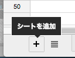
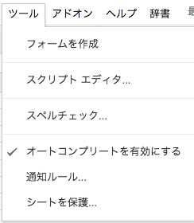
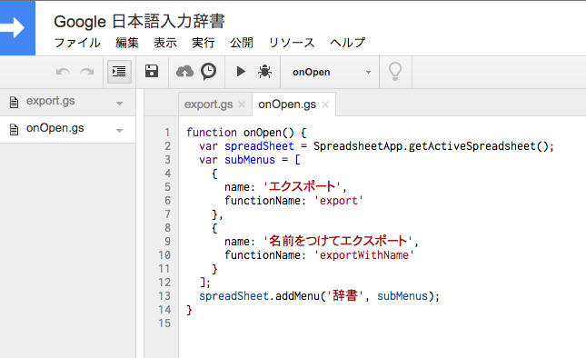
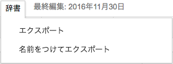
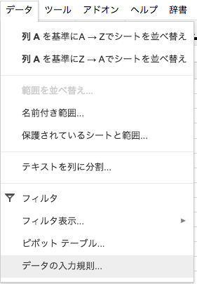
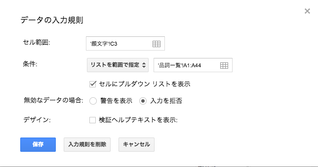
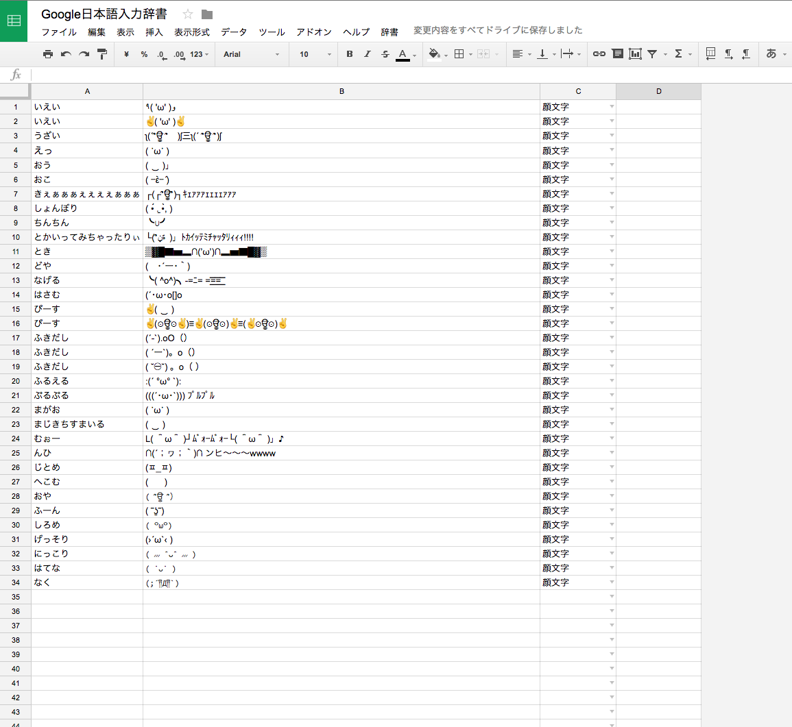

# google-japanese-input

Google日本語入力のカスタム辞書です

Google日本語入力にインポートするだけで使えます

( ◠‿◠ )」辞書は[dictionary](./dictionary)にあるぞ！

## Google Spreadsheet で管理する

### 1. `品詞一覧` シートを作成する

「シートを追加」から `品詞一覧` という名前のシートを作成する.

そして、[品詞一覧](./品詞一覧.txt)のデータを **A1** にカーソルをあてた状態でペーストする

### 2. スクリプトエディタを編集

[ツール] - [スクリプト エディタ…] をクリック

そして、[export.gs](./export.gs) と [onopen.gs](./onopen.gs) の内容をそれぞれコピペします

最後に保存します

すると、以下のように `辞書` というメニューが追加されます

### 3. データ用のシートを作成する

名前はなんでもいいです

今回は「顔文字」にします

### 4. C列に入力規則を設定する

[データ] - [データの入力規則] をクリック

セル範囲には図のようにC列を設定

条件には図のように品詞一覧のデータを設定

その他設定も図のようにすることをおすすめします

最後に[保存]を押して終了

### 5. 完成

あとはデータを入れるだけ

うまくいかない場合は、A-Dの4列だけにして他の列は削除してください

